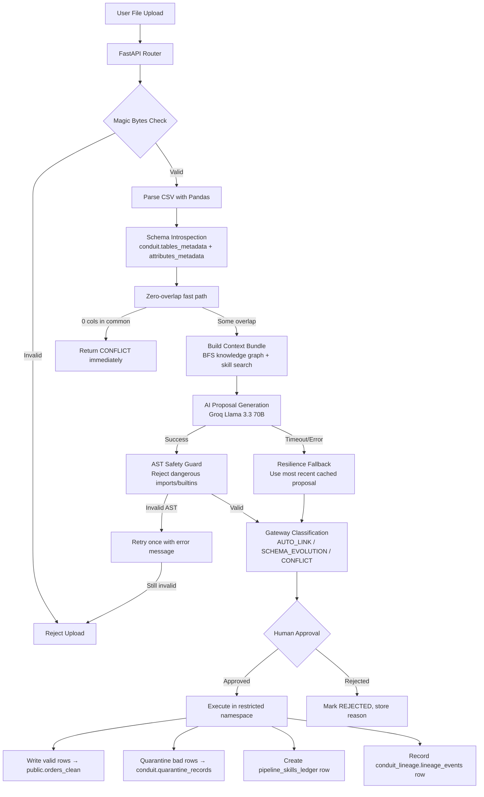

# Conduit

> **An autonomous data engineering agent that turns messy supplier CSVs into clean warehouse tables — with a human in the loop for anything risky.**

Conduit watches incoming data files, compares them to the target schema, and uses an LLM to generate a safe transformation script. The human engineer reviews the diff and clicks approve. The agent handles schema drift, PII masking, renames, null fills, missing columns, type casting — all of it.

Built around a **gatekeeper-classifier** pattern: the LLM never gets the final say. Every proposal is checked against deterministic rules before execution.

```
clean_orders.csv        →  AUTO_LINK          (no drift, auto-approved)
drifted_orders.csv      →  SCHEMA_EVOLUTION   (rename + null + extra col, needs review)
conflicted_orders.csv   →  CONFLICT           (type mismatch, blocked)
```

---

## Table of contents

- [Running with Docker (Recommended)](#running-with-docker-recommended)
- [Running without Docker (Natively)](#running-without-docker-natively)
- [Local testing & Verification](#local-testing--verification)
- [Project structure](#project-structure)
- [The agent pipeline](#the-agent-pipeline)
- [A realistic user journey](#a-realistic-user-journey)
- [Frontend pages](#frontend-pages)
- [Backend endpoints](#backend-endpoints)
- [Database schema](#database-schema)
- [Configuration](#configuration)
- [AI tools & safety](#ai-tools--safety)
- [Demo data](#demo-data)

---

## Running with Docker (Recommended)

This is the fastest way to get started. It containerizes the FastAPI backend, PostgreSQL databases, and Neo4j graph database.

### Prerequisites
- **Docker + Docker Compose** (Docker 20+)
- **Node.js** (20+)
- **Groq API Key** — get one free at [console.groq.com](https://console.groq.com)

### 1. Configure Environment
Copy the example environment configuration in the project root:
```bash
cp .env.example .env
```
Open the newly created `.env` file and set your `GROQ_API_KEY` (and any other desired variables).

### 2. Start the Backend Infrastructure
Run the following command in the project root directory:
```bash
docker compose up -d --build
```
This spins up four services:
- `api` (FastAPI backend server on port `8000`)
- `warehouse-db` (PostgreSQL target warehouse database on port `5432`)
- `source-db` (PostgreSQL source database on port `5433`)
- `neo4j` (Neo4j Graph Database on ports `7474`/`7687`)

Verify the backend is healthy:
```bash
curl http://localhost:8000/api/health
# → {"status":"ok","mock_ai":false,"environment":"development","neo4j":"connected"}
```

### 3. Load Database Seed Data (One-time)
Populate the PostgreSQL skills registry and lineage tables:

Run this command in the project root (works on Windows CMD/PowerShell, Linux, and macOS):
```bash
docker compose exec -T warehouse-db psql -U user -d warehousedb < db/seed_extensions.sql
```
> [!NOTE]
> SQL errors regarding `conduit_graph.graph_nodes` are expected and completely safe to ignore. The relationship graph has been migrated to Neo4j.

### 4. Start the Frontend UI
Launch the Next.js frontend:
```bash
cd frontend
npm install
npm run dev
```
Open **http://localhost:3000** in your browser. Next.js automatically proxies `/api/*` requests to port `8000`.

---

## Running without Docker (Natively)

You can run the entire system natively on your local machine if you prefer not to use containerization.

### Prerequisites
- **Python** (3.11+)
- **PostgreSQL** (15+) running locally
- **Node.js** (20+)
- **Groq API Key**
- **Neo4j DB** (You can use a local Neo4j installation, or configure a free remote [Neo4j Aura](https://neo4j.com/cloud/platform/aura-graph-database/) instance)

### 1. Set Up Local PostgreSQL Databases
Log in to your local PostgreSQL instance and run the following queries to create the databases and owner user:
```sql
CREATE USER conduit_user WITH PASSWORD 'password';
CREATE DATABASE warehousedb OWNER conduit_user;
CREATE DATABASE sourcedb OWNER conduit_user;
```

Now, import the database schemas and seeds:
```bash
# Seed target table schema
psql -U conduit_user -d warehousedb < db/seed_warehouse.sql

# Seed system skills and audit extensions data
psql -U conduit_user -d warehousedb < db/seed_extensions.sql
```

### 2. Configure Environment
Copy the example environment configuration in the `backend/` directory:
```bash
cp backend/.env.example backend/.env
```
Open `backend/.env` and update the database URLs and Neo4j credentials to match your local setup, and configure your `GROQ_API_KEY`.

### 3. Run the Backend API Natively
Open a terminal in the `backend/` directory, set up your virtual environment, install the dependencies, and start `uvicorn`:

```bash
cd backend
python -m venv .venv

# Activate virtualenv:
# On Windows (CMD/PowerShell):
.venv\Scripts\activate
# On Linux / macOS:
source .venv/bin/activate

pip install -r requirements.txt
uvicorn app.main:app --host 0.0.0.0 --port 8000 --reload
```
Check health:
```bash
curl http://localhost:8000/api/health
```

### 4. Run the Frontend UI Natively
In another terminal, navigate to the `frontend/` directory and spin up Next.js:
```bash
cd frontend
npm install
npm run dev
```
Open **http://localhost:3000** in your browser.

---

## Local testing & Verification

### Running Ingest via Command Line

You can trigger a test schema ingest using `curl` from your terminal to verify that the pipeline is working properly:

```bash
# Upload a clean order CSV and target it to orders_clean
curl -X POST http://localhost:8000/api/ingest \
  -F "file=@db/demo_csvs/clean_orders.csv" \
  -F "target_table=orders_clean" | python3 -m json.tool
```

The response will return a JSON payload containing a `proposal_id`. Copy that ID and run:

```bash
# 1. Fetch the generated proposal details
curl http://localhost:8000/api/proposals/<proposal_id>

# 2. Approve and execute the proposal
curl -X POST http://localhost:8000/api/proposals/<proposal_id>/approve \
  -H "Content-Type: application/json" \
  -d '{"human_approver_id": "demo_engineer_01"}'
```

Verify rows successfully landed in the database:
- **With Docker**:
  ```bash
  docker compose exec warehouse-db psql -U user -d warehousedb -c "SELECT COUNT(*) FROM public.orders_clean;"
  ```
- **Without Docker**:
  ```bash
  psql -U conduit_user -d warehousedb -c "SELECT COUNT(*) FROM public.orders_clean;"
  ```

### Running the Automated Test Suite

A comprehensive test suite is provided to verify all 12 system scenarios (A–L).

- **With Docker**:
  Ensure the containers are running, then run the checks inside the `api` container:
  ```bash
  docker compose exec api python run_checks.py
  ```

- **Without Docker**:
  Ensure the backend API is running locally, activate your virtual environment, install the dependencies, and run:
  ```bash
  python run_checks.py
  ```

---

## Project structure

```
Conduit/
├── backend/                    # FastAPI backend (Python 3.11)
│   ├── app/
│   │   ├── main.py             # App factory, CORS, router mounting
│   │   ├── database.py         # Async SQLAlchemy engine
│   │   ├── models.py           # Core ORM models (proposals, ledger, quarantine, …)
│   │   ├── extension_models.py # Phase 2 models (skills, graph, lineage)
│   │   ├── schemas.py          # Pydantic request/response models
│   │   ├── extension_schemas.py
│   │   ├── routers/            # 8 routers, 25+ endpoints
│   │   │   ├── ingest.py
│   │   │   ├── proposals.py
│   │   │   ├── audit.py
│   │   │   ├── quarantine.py
│   │   │   ├── sources.py
│   │   │   ├── skills.py
│   │   │   ├── graph.py
│   │   │   └── lineage.py
│   │   ├── services/           # Business logic
│   │   │   ├── ai_service.py            # Groq LLM call
│   │   │   ├── mcp_service.py           # Target schema fetch
│   │   │   ├── gateway_service.py       # AUTO_LINK / SCHEMA_EVOLUTION / CONFLICT
│   │   │   ├── validation_service.py    # Magic bytes + AST safety guard
│   │   │   ├── execution_service.py     # Run the generated code, write to warehouse
│   │   │   ├── context_retrieval_service.py  # Build the Phase 1 context bundle
│   │   │   ├── skill_registry_service.py
│   │   │   ├── graph_service.py
│   │   │   └── lineage_service.py
│   │   └── core/config.py      # Pydantic settings (env-driven)
│   ├── Dockerfile
│   └── requirements.txt
│
├── frontend/                   # Next.js 14 frontend (TypeScript, App Router)
│   ├── src/
│   │   ├── app/                # 12 pages, all client-rendered
│   │   │   ├── page.tsx                    # /          — Overview
│   │   │   ├── ingest/page.tsx             # /ingest    — Upload + state machine
│   │   │   ├── proposals/                  # /proposals + /proposals/[id]
│   │   │   ├── audit/                      # /audit + /audit/[id]
│   │   │   ├── quarantine/page.tsx
│   │   │   ├── skills/                     # /skills + /skills/[id]
│   │   │   ├── graph/page.tsx              # /graph     — BFS tools
│   │   │   ├── lineage/page.tsx            # /lineage
│   │   │   └── sources/page.tsx
│   │   ├── components/         # Reusable: PageHeader, CodeBlock, badges, …
│   │   └── lib/                # api.ts (REST client), types.ts, format.ts
│   ├── next.config.js          # /api/* → :8000 proxy
│   └── tailwind.config.js      # Inter font, neutral palette, design tokens
│
├── db/
│   ├── seed_warehouse.sql      # Auto-loaded on first container start
│   ├── seed_extensions.sql     # One-time manual seed (skills, graph, lineage)
│   └── demo_csvs/              # Test files
│
├── docker-compose.yml
├── capabilities.md             # Authoritative backend capability spec
├── frontend_requirements.md    # Authoritative frontend spec
├── PROJECT_STATUS.txt          # Build checklist
└── README.md
```

---

## The agent pipeline

Every `POST /api/ingest` runs through 10 steps inside the backend:



Two design choices worth highlighting:

1. **The LLM is called once, in step H.** Every other endpoint just reads.
2. **The AI's gateway recommendation is sanity-checked by `gateway_service`.** Critical issues and low confidence get force-upgraded to `CONFLICT` regardless of what the LLM said.

---

## A realistic user journey

**Persona:** Maya, data engineer. A new supplier CSV arrives in her inbox.

### 1. Morning dashboard

Maya opens `http://localhost:3000`. The **Overview** page shows her:
- Auto-resolved rate (what % of proposals auto-link without her touching them)
- 3 horizontal bars for gateway classification breakdown
- Recent proposals and executions
- Source health, skill count, graph node count

### 2. Drop the file

She clicks **Ingest**, drags `drifted_orders.csv` onto the upload zone. The state machine animates through 6 steps while the backend works:

1. Validating file magic bytes
2. Introspecting target schema
3. Building context bundle
4. Generating transformation script
5. Validating AST
6. Classifying gateway policy

~5s with `MOCK_AI=True`, 5–15s with real Groq. The animation is **purely visual** — there's no stream from the backend, we time-step it client-side and fast-forward when the API call returns.

### 3. Review the proposal

A "Proposal review" card appears with 4 stat tiles + the drift table. For `drifted_orders.csv` she sees:
- **Gateway:** yellow `Schema Evolution`
- **Confidence:** 85%
- **Drift items:** 3 (RENAME `order_amount` → `amount_usd`, NULL_VIOLATION in `order_status`, EXTRA_COLUMN `discount_code`)
- **PII columns:** customer_email

She clicks **Open detail view →** to read the actual generated code.

### 4. Inspect the detail

The proposal detail page has 4 tabs:
- **Drift** — the per-column issue breakdown
- **Generated code** — the actual Python script that will run
- **AI prompt** — what was sent to Groq, plus the raw response (post-execution only)
- **AI context bundle** — the related skills, entities, dependencies, and PII columns the agent considered (Phase 1)

### 5. Approve

She clicks **Approve & execute**. The backend:
1. Executes the generated code in a restricted namespace
2. Writes valid rows to `public.orders_clean`
3. Quarantines failed rows to `conduit.quarantine_records`
4. Creates a `conduit.pipeline_skills_ledger` row
5. Updates the proposal to status `EXECUTED`
6. Records a `conduit_lineage.lineage_events` row

The right sidebar switches from "Approve" to "Execution" with row counts.

### 6. Verify

Maya checks **Audit** for the immutable record, **Lineage** for the operation log, and **Quarantine** if any rows failed.

---

## Frontend pages

All pages are client-rendered (`"use client"`), styled with Tailwind, fonts: Inter, palette: neutral grays with `success` / `warning` / `danger` only used to direct attention.

| Route | Page | Purpose |
|---|---|---|
| `/` | Overview | Morning dashboard: auto-resolved rate, classification breakdown, recent activity, source health |
| `/ingest` | Ingest | Drop a file, watch the 6-step state machine, review the proposal |
| `/proposals` | Proposals list | Paginated queue of all past proposals, filterable by gateway status, searchable by target table |
| `/proposals/[id]` | Proposal detail | Drift + code + AI prompt + context bundle tabs, approve/reject |
| `/audit` | Audit ledger | Immutable execution history (compliance) |
| `/audit/[id]` | Audit detail | Full audit row with executed script, AI prompt, raw response |
| `/quarantine` | Quarantine | Rows that failed validation, with raw data + failure reason |
| `/skills` | Skill registry | Catalog of reusable transformation skills (grid/table toggle, category/status filters) |
| `/skills/[id]` | Skill detail | A specific skill's scripts, examples, issue references |
| `/graph` | Knowledge graph | Browser for nodes/edges, plus forward BFS (lineage explorer) and reverse BFS (impact analyzer) |
| `/lineage` | Lineage events | Chronological log of all pipeline operations |
| `/sources` | Sources | Registered warehouses and their connection status |

---

## Backend endpoints

### Core ingest + proposals

| Method | Endpoint | Purpose |
|---|---|---|
| `POST` | `/api/ingest` | The big one — full pipeline: validate → parse → schema compare → LLM → AST → classify → save |
| `GET` | `/api/proposals` | Paginated list of all proposals (`?status=` filter, `?limit=`, `?offset=`) |
| `GET` | `/api/proposals/{id}` | Single proposal with drift, code, confidence, PII |
| `POST` | `/api/proposals/{id}/approve` | Execute the saved code against the warehouse, write rows, update audit |
| `POST` | `/api/proposals/{id}/reject` | Mark proposal as `REJECTED` with a reason |
| `GET` | `/api/proposals/{id}/context` | The Phase 1 context bundle: related skills, entities, dependencies, PII, business context |

### Audit + quarantine + sources

| Method | Endpoint | Purpose |
|---|---|---|
| `GET` | `/api/audit` | Audit ledger (`?proposal_id=` filter for one row, `?limit=`, `?offset=`) |
| `GET` | `/api/audit/{id}` | Single audit row with full LLM prompt/response |
| `GET` | `/api/quarantine` | All quarantined rows |
| `GET` | `/api/quarantine/{proposal_id}` | Quarantined rows for a specific proposal |
| `GET` | `/api/sources` | Registered warehouses and connection status |

### Skill registry

| Method | Endpoint | Purpose |
|---|---|---|
| `GET` | `/api/skills` | List skills (`?category=`, `?status=`, `?limit=`, `?offset=`) |
| `GET` | `/api/skills/search?q=` | Keyword search across name/description/use_cases |
| `GET` | `/api/skills/{id}` | Skill with scripts, examples, issue references |
| `POST` | `/api/skills` | Register a new skill |
| `PATCH` | `/api/skills/{id}` | Update skill status, owner, description |
| `POST` | `/api/skills/{id}/scripts` | Attach a script reference to a skill |
| `POST` | `/api/skills/{id}/issues` | Link a past incident to a skill |

### Knowledge graph

| Method | Endpoint | Purpose |
|---|---|---|
| `GET` | `/api/graph/nodes` | All graph nodes (`?node_type=` filter) |
| `POST` | `/api/graph/nodes` | Create a node (idempotent: get-or-create on `node_type + entity_id`) |
| `GET` | `/api/graph/edges` | All graph edges (`?relation_type=` filter) |
| `POST` | `/api/graph/edges` | Create an edge (idempotent on `source + target + relation`) |
| `GET` | `/api/graph/neighbors/{node_id}` | 1-hop neighbors (`?direction=in|out|both`) |
| `GET` | `/api/graph/lineage/{entity}` | Forward BFS — what does this entity reach? (`?max_depth=`) |
| `GET` | `/api/graph/impact/{entity}` | Reverse BFS — what depends on this entity? |

### Lineage

| Method | Endpoint | Purpose |
|---|---|---|
| `GET` | `/api/lineage` | All lineage events, most recent first (`?limit=`, `?offset=`) |
| `GET` | `/api/lineage/{proposal_id}` | Lineage events for a specific proposal, in execution order |

---

## Database schema

Five schemas in `warehousedb`, one in `sourcedb`:

| Schema | Tables | What lives here |
|---|---|---|
| `public` | `orders_clean` | The actual business data — only written after a proposal is approved and executed |
| `conduit` | `proposals`, `pipeline_skills_ledger`, `quarantine_records`, `tables_metadata`, `attributes_metadata`, `sub_projects`, `warehouse_units` | Core pipeline state |
| `conduit_skills` | `skills`, `skill_scripts`, `skill_examples`, `skill_issue_references`, `proposal_contexts` | The skill registry + per-proposal context bundles |
| `conduit_graph` | `graph_nodes`, `graph_edges` | The relationship graph (tables, skills, KPIs, PII columns, projects) |
| `conduit_lineage` | `lineage_events` | Per-operation breadcrumbs (ingest, transform, validate, quarantine, evolve) |

`conduit.proposals` is the heart of the system — every uploaded file becomes a row here with status `PENDING` → `APPROVED` → `EXECUTED` (or `REJECTED` / `FAILED`).

`sourcedb` is currently a placeholder — registered via `/api/sources` but not actually read from yet. Future work.

---

## Configuration

| Env var | Where | Default | Purpose |
|---|---|---|---|
| `GROQ_API_KEY` | Root `.env` | — | **Required.** API key for Groq LLM calls |
| `MOCK_AI` | Root `.env` | `False` | If `True`, AI service returns stub responses without calling Groq (dev only) |
| `POSTGRES_PASSWORD` | Root `.env` | `password` | Used by both DB containers |
| `ENVIRONMENT` | Root `.env` | `development` | Logged in API responses |
| `WAREHOUSE_DB_URL` | Root `.env` | `postgresql+asyncpg://…` | Backend connects here (overrides the per-service default) |
| `SOURCE_DB_URL` | Root `.env` | `postgresql+asyncpg://…` | Future use |

> **Docker quirk:** `docker compose up -d --force-recreate` is required to pick up changes to `.env` after the first run. Plain `restart` keeps the old env.

---

## AI tools & safety

- **Model:** Groq `llama-3.3-70b-versatile` for fast, structured JSON output. Configurable in `backend/app/services/ai_service.py`.
- **AST Safety Guard:** Every piece of AI-generated code is parsed with `ast.parse` and checked against an imports/builtins blocklist before execution. The blocklist rejects `os`, `sys`, `subprocess`, `eval`, `exec`, and any file/network I/O. If validation fails, the system retries once with the failure reason appended to the prompt.
- **Rule-based Gateway Override:** The LLM's `gateway_recommendation` is sanity-checked. Critical mismatches (TYPE_MISMATCH, missing required columns) and low confidence are force-upgraded to `CONFLICT` regardless of what the LLM said.
- **Resilience Fallback:** If Groq is unreachable, the system fetches the most recent successfully executed proposal for the same source/target schema and serves it as a fallback. The user sees a `reasoning_note` explaining the substitution.
- **Context Bundle (Phase 1):** The bundle is built (BFS the knowledge graph for related entities, dependencies, PII columns; search the skill registry for matching skills) and stored alongside the proposal. **It is not yet injected into the LLM prompt** — that's Phase 2. The new "AI context bundle" tab on the proposal detail page is the user-facing window into what's been collected.

---

## Demo data

Three CSVs in `db/demo_csvs/`:

| File | What it tests | Expected classification |
|---|---|---|
| `clean_orders.csv` | Schema matches target exactly | `AUTO_LINK` |
| `drifted_orders.csv` | Column rename, null, extra column | `SCHEMA_EVOLUTION` |
| `conflicted_orders.csv` | Type mismatches, missing required | `CONFLICT` |

The target is `public.orders_clean` (the only registered table in `conduit.tables_metadata`).
